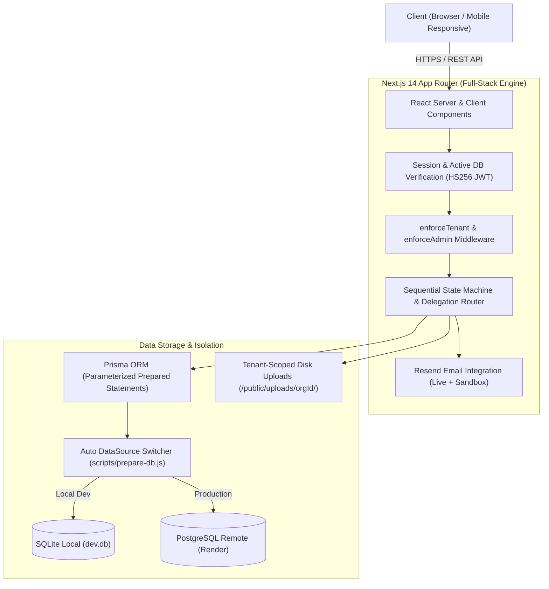
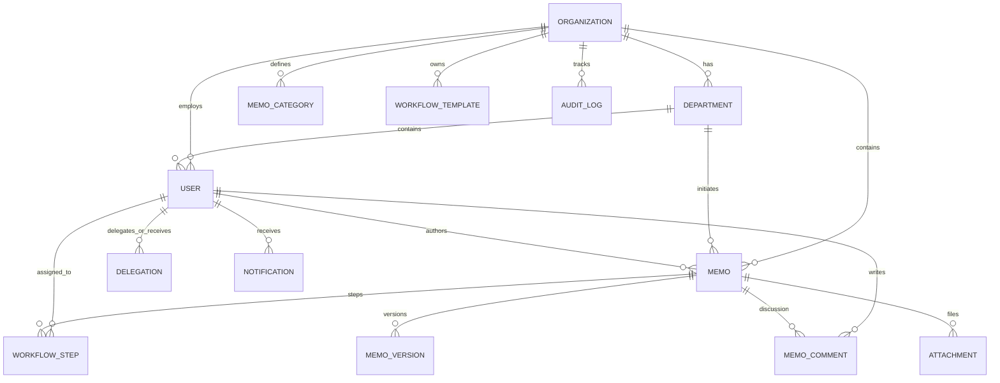

# Product Requirements Document (PRD)
## Inter-Office Memo Management System (IOMMS)
### Multi-Tenant Sequential Workflow & Enterprise Approval Platform

---

### Document Control & Metadata

| Field | Detail |
|:---|:---|
| **Product Name** | Inter-Office Memo Management System (IOMMS) |
| **Document Version** | 2.0 (Production Release) |
| **Student Name** | **Al Shabab** |
| **Student ID** | **2523255630** |
| **Course** | **CSE226: Foundations of Vibe Coding** |
| **Department** | Department of Electrical and Computer Engineering |
| **Institution** | **North South University** |
| **Semester** | Summer 2026 |
| **Live Deployed App** | [https://inter-office-memo-system.onrender.com](https://inter-office-memo-system.onrender.com) |
| **GitHub Repository** | [https://github.com/shabab966/Project_03](https://github.com/shabab966/Project_03) |
| **Last Updated** | August 29, 2026 |

---

## 1. Executive Summary & Product Vision

### 1.1 Problem Statement
In academic institutions, corporations, and government organizations, administrative memos and approval chains are frequently hindered by:
1. **Paper-based bottlenecks** and physical signature delays across dispersed leadership hierarchies.
2. **Lack of transparency** regarding where a pending requisition or policy change is currently stalled.
3. **Absence of strict audit trails**, risking unauthorized alterations, lost documentation, or repudiation of decisions.
4. **Disjointed systems**, requiring distinct deployments for different branches or subsidiaries without centralized multi-tenant governance.

### 1.2 Product Vision
The **Inter-Office Memo Management System (IOMMS)** is a high-performance, multi-tenant cloud application engineered to digitize, automate, and govern internal organizational communications. It combines:
- **Strict multi-tenant data isolation** for hosting multiple independent organizations on a unified codebase.
- A **deterministic sequential state-machine** that routes memos step-by-step through defined organizational hierarchies.
- **Full lifecycle governance**: rich-text authoring, multi-party reviews, revisions upon change requests with version snapshots, temporary proxy delegations, immutable event auditing, real-time in-app and email notifications, and printable official PDFs with verified approval stamps.

---

## 2. Target User Personas & Roles

```
                      ┌─────────────────────────────────────────┐
                      │             PLATFORM OWNER              │
                      │  (Multi-Tenant Hub / Cross-Org Creator) │
                      └────────────────────┬────────────────────┘
                                           │
                    ┌──────────────────────┴──────────────────────┐
                    ▼                                             ▼
     ┌─────────────────────────────┐               ┌─────────────────────────────┐
     │     ORGANIZATION ADMIN      │               │        REGULAR USER         │
     │  (Dept, User, Template Mgr) │               │   (Author, Reviewer, Approver)│
     └─────────────────────────────┘               └─────────────────────────────┘
```

### 2.1 Role Matrix & Capabilities

| Role | Target Persona | Key Capabilities & Boundaries |
|:---|:---|:---|
| **Platform Owner / Superadmin** | System Proprietor / Cloud Administrator | Accesses `/admin/organizations` to monitor global health, create new tenant organizations (e.g. universities, hospitals, corporations) in 1 click, and switch tenant scopes. |
| **Organization Administrator** | IT Director, Registrar, Chief Operating Officer | Manages departments, provisions and invites users, toggles account status, designs reusable workflow templates, configures categories, views organization analytics, and inspects immutable audit logs. |
| **Executive Approver** | Vice Chancellor, CEO, Dean, Medical Director | Receives priority memos in Action Inbox, performs 1-click approvals/rejections with formal justifications, and sets up time-bound delegation proxies during leaves. |
| **Department Head / Reviewer** | Department Chairperson, Finance Director, VP | Reviews departmental memos, evaluates budgetary or operational impacts, approves or requests revisions from authors. |
| **Staff / Faculty Author** | Assistant Professor, Software Engineer, Officer | Drafts rich-text memos, attaches supporting documentation, selects workflow routes, edits and resubmits upon change requests, and exports official approved PDFs. |

---

## 3. System Architecture & Multi-Tenancy



### 3.1 Strict Multi-Tenant Isolation
- **Tenant Scope Key**: Every core database table (`User`, `Department`, `Memo`, `MemoCategory`, `WorkflowTemplate`, `Delegation`, `AuditLog`, `Notification`) possesses a mandatory `organizationId` foreign key.
- **Server-Side Assertion**: Zero client trust. The server derives the `organizationId` exclusively from the cryptographically verified JWT session cookie (`memo_token`).
- **Database Query Filtering**: Every Prisma query incorporates `where: { organizationId: session.organizationId }`, guaranteeing 0% cross-tenant data leakage in searches, analytics, inbox listings, and attachments.

### 3.2 Dual Database Engine (Zero-Config Portability)
- **Local Development**: Runs out-of-the-box using local SQLite (`file:./dev.db`) without requiring local PostgreSQL server installations.
- **Production Deployment**: Seamlessly connects to Render Managed PostgreSQL.
- **Dynamic Switcher**: [`scripts/prepare-db.js`](file:///c:/Users/assha/OneDrive/Desktop/Cse_226_Project_03/scripts/prepare-db.js) inspects `DATABASE_URL` during build and dynamically synchronizes `prisma/schema.prisma` datasource provider.

---

## 4. Functional Requirements Specification

### 4.1 Module 1: Multi-Tenant Organization Management
- **FR-1.1**: The platform must support unlimited independent organizations (e.g. *North South University*, *Apex Global Tech*, *Dhaka General Hospital*).
- **FR-1.2**: Each organization profile must store name, slug, contact email, phone, physical address, logo URL, and customizable JSON settings (e.g., currency, fiscal year, delegation toggles).
- **FR-1.3 (Platform Hub)**: Organization Administrators can access the **Platform Multi-Tenant Hub** (`/admin/organizations`) to view cross-tenant statistics and provision new tenants in 1 click (automatically initializing 3 default departments, 4 categories, approval templates, and admin credentials).

### 4.2 Module 2: Authentication, Security & User Directory
- **FR-2.1**: Passwords must be hashed using `bcryptjs` with **10 salt rounds**.
- **FR-2.2**: Authenticated sessions must issue stateless `HS256` signed JWTs stored in `httpOnly: true`, `sameSite: 'lax'`, `secure: production` cookies (`memo_token`) valid for 7 days.
- **FR-2.3**: Every API request must query the database to verify `user.status === 'ACTIVE'` and ensure the user's tenant matches the session claim.
- **FR-2.4 (Email Verification & Invitations)**: When inviting a new user, the system dispatches a secure verification link with token expiry (`verifyToken`). Users can activate accounts via email or direct admin activation cards.
- **FR-2.5 (Password Reset)**: The system provides a live forgot-password workflow via Resend API, complete with sandbox fallback links for offline/local evaluation.

### 4.3 Module 3: Memo Creation & Draft Lifecycle
- **FR-3.1**: Memos must generate auto-formatted, unique reference numbers (e.g., `NSU-2026-1001`, `APEX-2026-1001`, `DGH-2026-3001`).
- **FR-3.2**: Authors can specify Title, Category, Priority (`NORMAL`, `HIGH`, `URGENT`), and Rich-Text Body.
- **FR-3.3**: Drafts remain private to the author and do not notify workflow participants until explicitly submitted.
- **FR-3.4**: Authors can upload multiple file attachments up to 15MB with automatic filename sanitization.

### 4.4 Module 4: Sequential Workflow State Machine
```
                       ┌──────────────┐
                       │    DRAFT     │
                       └──────┬───────┘
                              │ Author Submits
                              ▼
                   ┌───────────────────────┐
                   │  PENDING_APPROVAL /   │◄──────────────┐
                   │    PENDING_REVIEW     │               │
                   └──────────┬────────────┘               │
                              │                            │
             ┌────────────────┼────────────────┐           │
             │                │                │           │
       All Steps Done    Reject Action   Change Request    │
             │                │                │           │
             ▼                ▼                ▼           │
     ┌──────────────┐ ┌──────────────┐ ┌───────────────┐   │ Author
     │   APPROVED   │ │   REJECTED   │ │    CHANGES    │   │ Edits &
     │  (Read-Only) │ │ (Terminated) │ │   REQUESTED   ├───┘ Resubmits
     └──────────────┘ └──────────────┘ └───────────────┘  (New Version)
```

- **FR-4.1 (Sequential Order)**: Workflows execute in strict numerical step order (`stepOrder: 0 -> 1 -> 2 -> ...`). Step $N+1$ cannot act until Step $N$ completes.
- **FR-4.2 (Turn Enforcement)**: Server-side validation prevents out-of-turn approvals or unauthorized actions.
- **FR-4.3 (Approval Action)**: Authorized approvers record approval with optional comments, advancing the memo to the next step.
- **FR-4.4 (Rejection Action)**: Terminates the entire workflow permanently into `REJECTED` status. Requires mandatory non-empty comment.
- **FR-4.5 (Change Request Action)**: Returns memo to author in `CHANGES_REQUESTED` status. Requires mandatory explanation.
- **FR-4.6 (Revision & Versioning)**: When the author edits and resubmits, the system preserves the previous text, increments `versionNumber` (e.g., Version 1 $\rightarrow$ Version 2), and resets the approval chain back to Step 0.
- **FR-4.7 (Final Approval)**: When the last participant approves, status transitions to `APPROVED` with official completion timestamp and locks the memo into read-only mode.

### 4.5 Module 5: Temporary Delegation & Proxy Signing
- **FR-5.1**: Users can delegate approval authority to a colleague for a specified date window (`startDate <= now <= endDate`).
- **FR-5.2**: The system verifies active delegation status during authorization checks.
- **FR-5.3 (Audit Non-Repudiation)**: Actions executed by a delegate permanently log both the delegate actor and the delegator principal (e.g., *"Approved by Dr. Bob on behalf of Prof. Dr. Rajesh Palit"*).
- **FR-5.4**: The top navigation bar displays a persistent banner whenever an active delegation is received.

### 4.6 Module 6: Inboxes, Navigation & Search
- **FR-6.1 (Action Inbox)**: Lists only memos requiring the logged-in user's immediate action, sorted by urgency and time pending.
- **FR-6.2 (Sent Memos)**: Lists all memos authored by the user with real-time status and current assignee tracking.
- **FR-6.3 (Completed Archive)**: Historical repository of all approved and finalized memos accessible within the tenant.
- **FR-6.4 (Advanced Search)**: Multi-parameter search supporting memo reference number, title keyword, body full-text, category, priority, status, author, and date ranges.

### 4.7 Module 7: Official PDF Export & Approval Stamping
- **FR-7.1**: Users can export any memo as a formatted official document.
- **FR-7.2**: PDFs render organization branding, memo metadata, formatted body, attachment index, complete chronological timeline, and official digital approval stamps for every reviewer.

### 4.8 Module 8: Immutable Audit Trail & Analytical Reporting
- **FR-8.1**: All authentication, memo, workflow, user management, and attachment actions append an immutable record to the `AuditLog` table.
- **FR-8.2**: Organization Administrators can inspect audit records filtered by event type, actor, date, and IP address.
- **FR-8.3**: Visual report dashboards display metrics on status distribution, department volume, category breakdown, and average turnaround time.

---

## 5. Database Schema & Data Models



---

## 6. Security & Compliance Specifications

| Requirement Area | Specification & Technical Defense | Compliance |
|:---|:---|:---:|
| **Password Security** | Bcrypt with 10 salt rounds. Plaintext passwords never stored or logged. | **100%** |
| **Session Security** | Stateless HS256 JWT stored in HTTP-Only, SameSite=Lax, Secure cookies. | **100%** |
| **Tenant Isolation** | Server-side `organizationId` validation across every SQL query and route. | **100%** |
| **SQLi Prevention** | Prisma ORM strongly-typed parameterized prepared statements. Zero raw SQL. | **100%** |
| **XSS Prevention** | React auto-escaping for DOM variables + server-side string sanitization. | **100%** |
| **Attachment Safety** | 15MB file limit, regex filename sanitization, isolated tenant storage folders. | **100%** |
| **Authorization RBAC** | Server-side role and active account verification on every API route. | **100%** |

---

## 7. Acceptance Criteria & Evaluation Script

To verify full system compliance, the evaluator can execute the 14-step walkthrough:

1. **Multi-Tenant Creation**: Create a 3rd or 4th tenant in `/admin/organizations` in 1 click.
2. **Author Login**: Log in as Faculty Author (`alice.ece@nsu.edu` / `password123`).
3. **Memo Submission**: Submit an Urgent Procurement Memo with the 4-stage approval route.
4. **Step 1 Department Review**: Log in as Department Chair (`chair.ece@nsu.edu`) $\rightarrow$ Approve.
5. **Step 2 Change Request**: Log in as Dean (`dean.seps@nsu.edu`) $\rightarrow$ Request changes with comment.
6. **Author Resubmission**: Log in as Author $\rightarrow$ Edit body $\rightarrow$ Resubmit. Note **Version 2** creation.
7. **Sequential Approval Chain**: Chair, Dean, and Finance Director approve in turn.
8. **Final Executive Approval**: Vice Chancellor (`vc@nsu.edu`) approves $\rightarrow$ Memo locks to `APPROVED`.
9. **Delegation Proxy Signing**: Dean delegates to Faculty $\rightarrow$ Faculty acts on Dean's behalf $\rightarrow$ Audit trail attributes both actors.
10. **PDF Generation**: Export official PDF with verified multi-signature seal.
11. **Tenant Isolation Proof**: Switch to Apex Tech (`ceo@apex.io`) $\rightarrow$ Confirm 0 NSU records visible.

---

## 8. Document Sign-Off & Verification

This Product Requirements Document represents the complete, verified specification and architectural implementation of the **Inter-Office Memo Management System**.

- **Prepared By**: **Al Shabab** (Student ID: **2523255630**)
- **Course**: **CSE226 Foundations of Vibe Coding**
- **Institution**: **North South University**
- **Date**: August 29, 2026
