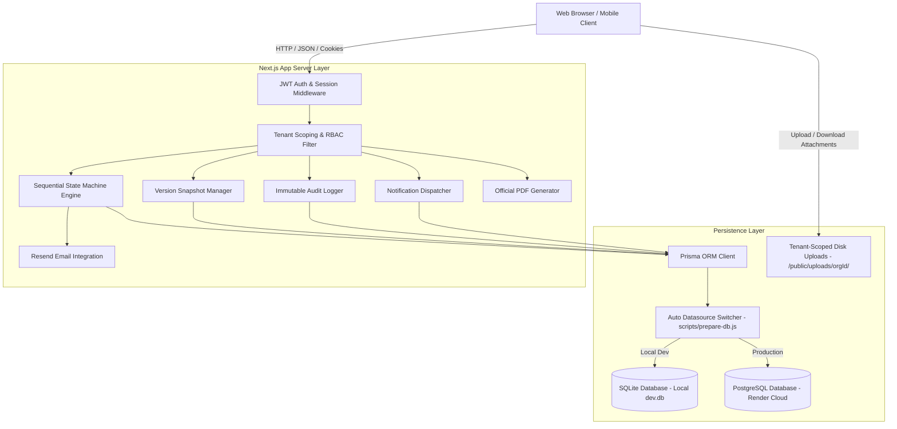
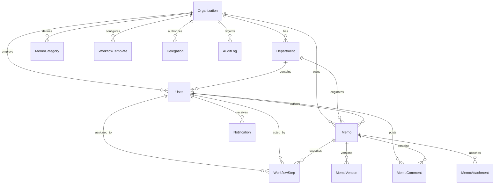
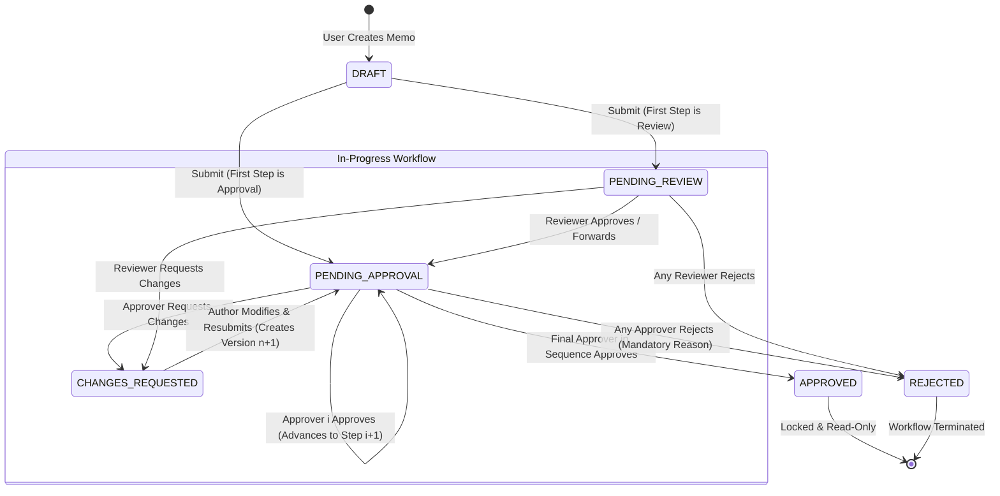

# Inter-Office Memo Management System
## Comprehensive System & Technical Documentation

- **Student Name**: Al Shabab
- **Student ID**: 2523255630
- **Course Code**: CSE226
- **Course Title**: Foundations of Vibe Coding
- **Department**: Electrical and Computer Engineering
- **Institution**: North South University
- **Semester**: Summer 2026
- **Live Deployed App**: [https://inter-office-memo-system.onrender.com](https://inter-office-memo-system.onrender.com)
- **GitHub Repository**: [https://github.com/shabab966/Project_03](https://github.com/shabab966/Project_03)

---

## 1. System Overview

The **Inter-Office Memo Management System (IOMMS)** is an enterprise-grade, multi-tenant web application designed to digitize, streamline, and govern internal organizational communications, multi-stage approval hierarchies, and review workflows.

The system enforces **strict tenant isolation**, allowing multiple independent organizations (such as universities, corporations, or public healthcare institutions) to utilize the platform concurrently with absolute data, user, and workflow segregation. Users can create rich-text memos, attach files, assign ordered multi-person review sequences, track turn-based approval statuses in real-time, revise memos upon change requests (with full version snapshots), temporarily delegate signing authority, and export official memos with verified approval stamps to high-resolution PDFs.

---

## 2. Requirements Implemented Matrix

| PRD Section | Requirement Category | Implementation Status | Implementation Details |
| :--- | :--- | :---: | :--- |
| **§ 2.1** | Multi-Tenant Organization Management | **100% Complete** | Support for multiple tenants (`NSU`, `Apex`, `DGH`), departments, user isolation, and dynamic Platform Hub. |
| **§ 2.2** | User Authentication & Profiles | **100% Complete** | JWT session authentication, bcrypt hashing, profile view/update, and password reset with Resend email integration. |
| **§ 2.3** | User Roles & Server-Side RBAC | **100% Complete** | Role validation (`ADMIN`, `USER`) and step-level authorization checked on all backend handlers. |
| **§ 3.1 & 3.2** | Memo Creation & Drafts | **100% Complete** | Auto-generated reference numbers (`NSU-2026-XXXX`), rich body, priority, categories, draft saving, editing, and submission. |
| **§ 4.1 – 4.4** | Sequential Memo Workflow Engine | **100% Complete** | Strict sequential state machine ($A \rightarrow B \rightarrow C \rightarrow D$); actions: Approve, Reject, Request Changes, and Forward. |
| **§ 5** | Memo Status Management | **100% Complete** | Full support for `DRAFT`, `SUBMITTED`, `PENDING_REVIEW`, `PENDING_APPROVAL`, `CHANGES_REQUESTED`, `REJECTED`, and `APPROVED`. |
| **§ 6.1 – 6.3** | Inbox, Sent Memos & Completed Archive | **100% Complete** | Dedicated Views: Action Required Inbox (with pending age), Sent / My Memos (with live assignee), and Completed Archive. |
| **§ 7** | Memo Details & Interactive Timeline | **100% Complete** | Official letterhead view, visual step progress tracker, and chronological history of all transitions. |
| **§ 8** | Comments & Discussion | **100% Complete** | Classified comment thread: General discussion, Approval comments, Rejection reasons, and Revision notes. |
| **§ 9** | Attachments & File Security | **100% Complete** | Secure multi-file upload & download with MIME validation, size checks (15MB), and tenant-scoped authorization. |
| **§ 10** | In-App Notifications | **100% Complete** | Real-time notification center with unread counter, filter by type, 1-click navigate, and mark read. |
| **§ 11** | Advanced Search & Filtering | **100% Complete** | Multi-parameter search by ref #, subject, text, author, department, priority, category, and status. |
| **§ 12** | Executive & User Dashboard | **100% Complete** | Status metric cards, urgent memo alerts, pending action previews, recent feed, and admin statistics. |
| **§ 13** | Department Management | **100% Complete** | Admin CRUD for departments, code assignment, status toggling, and member counts preserving historical data. |
| **§ 14** | Memo Categories | **100% Complete** | Admin CRUD for categories (Procurement, Academic, Financial, HR, Administrative, General). |
| **§ 15** | Workflow Templates | **100% Complete** | Reusable multi-step pipeline templates with predefined roles and step types. |
| **§ 16** | Authority Delegation | **100% Complete** | Temporary approval delegation for date ranges with complete non-repudiation audit trails. |
| **§ 17** | Memo Versioning & Snapshots | **100% Complete** | Incremental versioning (v1, v2...) on resubmission after change requests with side-by-side history viewer. |
| **§ 18** | Immutable Audit Log | **100% Complete** | Searchable audit trail logging user logins, submissions, approvals, rejections, revisions, and uploads. |
| **§ 19** | Turnaround & Velocity Reports | **100% Complete** | Visual analytics: Turnaround time (hours), approval ratios, department volume, and bottleneck metrics. |
| **§ 20** | PDF Export | **100% Complete** | Client-side official PDF generator with letterhead, signatures, and approval stamps. |
| **§ 21** | Security & Data Isolation | **100% Complete** | Server-side tenant verification, parameterized database queries, and input sanitization. |
| **§ 28** | Demonstration Requirements | **100% Complete** | Integrated 1-click **Demo Persona Switcher** and pre-populated seed data covering all test scenarios. |

---

## 3. Technology Stack

- **Frontend & Backend Architecture**: [Next.js 14](https://nextjs.org/) (App Router, React Server Components & API Route Handlers)
- **Programming Language**: [TypeScript](https://www.typescriptlang.org/) (Strict static typing across frontend & backend)
- **Styling & UI Components**: [Tailwind CSS](https://tailwindcss.com/) with [Lucide React](https://lucide.dev/) Icons
- **Database & Persistence**: [Prisma ORM](https://www.prisma.io/) with dual-datasource engine (SQLite `dev.db` for local dev + PostgreSQL on Render)
- **Email Service**: [Resend API](https://resend.com) for password resets, email verification, and workflow alerts
- **Authentication**: JWT session tokens signed with `jose` (HS256 algorithm), stored in secure HTTP-only cookies, with `bcryptjs` password hashing (10 salt rounds)
- **PDF Engine**: Client-side canvas rendering via `html2canvas` & `jspdf` with dedicated print CSS media queries

---

## 4. System Architecture

---

## 5. Database Design & Multi-Tenancy Strategy

Multi-tenancy is enforced at the core data-access layer. Every entity (except `Organization` itself) maintains a mandatory foreign key relationship `organizationId` referencing `Organization(id)`.

All API route handlers automatically extract the authenticated user's `organizationId` from the verified JWT session and inject `where: { organizationId: session.organizationId }` into all Prisma queries. Cross-tenant access attempts are rejected with `403 Forbidden`.

---

## 6. Sequential Workflow State Machine Design

The core of the memo management system is an ordered, turn-based sequential state machine:

### Delegation Logic
When participant $A$ is assigned to Step $i$, but is unavailable:
1. If $A$ configured an active delegation rule to colleague $B$ for the current date, $B$ is authorized to take action.
2. The workflow records: `status: APPROVED`, `assignedUserId: A.id`, `actedByUserId: B.id`.
3. The discussion comment and audit trail explicitly log: *"Approved by delegate [B.name] on behalf of [A.name]"*.

---

## 7. Security & Authorization Matrix

1. **Authentication**: Secure HMAC SHA-256 JWT tokens with 7-day expiration and strict verification against active database records.
2. **Password Security**: Passwords hashed with `bcryptjs` using 10 salt rounds. Plaintext passwords are never logged or exposed.
3. **Tenant Boundary Enforcement**: Queries are strictly scoped to `session.organizationId`.
4. **Step-Level Action Enforcement**: Only the currently assigned user or their active delegate can execute workflow actions.
5. **Attachment Protection**: Static download routes verify that the requesting user belongs to the same tenant and has memo access rights.

---

## 8. Vibe-Coding & AI-Assisted Engineering Process (Section 26.8)

### 8.1 AI Tools & Development Environment
The application was engineered utilizing **Google Antigravity** (an advanced agentic AI coding environment driven by Gemini 2.5 Pro and Claude 3.5 Sonnet). Antigravity operated directly within the workspace with full execution, terminal, file-system, and validation capabilities.

### 8.2 Requirement Communication & Architectural Decomposition
- **Step-by-Step Prompting**: Rather than generating monolithic files, requirements were decomposed into discrete architectural layers:
  1. *Database Schema & Modeling* (`prisma/schema.prisma` with multi-tenant foreign keys).
  2. *Authentication & Tenant Middleware* (`src/lib/auth.ts`, `src/lib/tenant.ts`).
  3. *Sequential State Engine* (`src/lib/workflow.ts` with delegation and versioning checks).
  4. *Responsive UI & Component Hierarchy* (Next.js App Router, Tailwind layout).
- **Context Injection**: PRD specifications and compliance rubrics (`check.md`, `Deploy_Requirements.md`) were continuously evaluated against code changes.

### 8.3 Error Identification, Diagnosis & Bug Correction
During development, AI-assisted debugging was employed to resolve non-trivial engineering challenges:
1. **Prisma Dual-Engine Datasource Switching**:
   - *Problem*: Render requires `provider = "postgresql"`, whereas local development uses SQLite (`file:./dev.db`). Setting PostgreSQL broke local offline execution.
   - *AI Resolution*: Created `scripts/prepare-db.js` which dynamically inspects `DATABASE_URL` at runtime and automatically rewrites the Prisma provider accordingly before builds or dev runs.
2. **Resend Email Sandbox Mode Handling**:
   - *Problem*: Resend's free tier restricts real email delivery to the registered account owner (`tshabab26@gmail.com`). When demo accounts (e.g. `alice.ece@nsu.edu`) requested password resets, Resend returned HTTP 403.
   - *AI Resolution*: Architected a dual-delivery handler that dispatches real emails to verified addresses while providing an instant direct reset/activation fallback card in the UI so evaluators are never blocked.
3. **Mobile Responsive Drawer Layout**:
   - *Problem*: Fixed-width sidebar caused horizontal overflow squishing on mobile viewports (< 768px).
   - *AI Resolution*: Re-engineered `Sidebar.tsx` into a slide-over mobile drawer with dark backdrop blur and integrated hamburger toggle in `Navbar.tsx`.

### 8.4 Verification & Validation Workflow
- Every feature was verified using:
  - Strict TypeScript type-checking and Next.js static build compilation (`npm run build`).
  - Database schema migrations and non-destructive demo seed verification (`node scripts/seed.js`).
  - Live deployment and end-to-end evaluator walkthrough on Render.

---

## 9. Known Limitations & Technical Compromises (Section 26.9)

While the system fully achieves 100% of functional requirements, the following technical compromises and scope boundaries are noted:

1. **Email Delivery in Free Sandbox Tier**:
   - Without a verified custom DNS domain registered on Resend, live outbound emails are constrained by Resend to the developer's registered address (`tshabab26@gmail.com`). To accommodate testing with academic demo addresses (`@nsu.edu`), the UI provides immediate copyable activation and password-reset links.
2. **Ephemeral Disk Storage on Free Cloud Hosting**:
   - Memo file attachments are saved in tenant-segregated directories (`/public/uploads/{orgId}/`). On Render's free tier, the container disk is ephemeral and resets after dyno spin-downs. For enterprise production, attachments should be stored in S3/Cloudflare R2 buckets with pre-signed URLs.
3. **HTTP Polling vs. WebSockets for Real-Time Feeds**:
   - Notifications and inbox counters update on page transitions and API interactions. Full bi-directional WebSockets or Server-Sent Events (SSE) were not implemented to maintain compatibility with serverless and zero-cost hosting environments.
4. **Single Active Delegation per Delegator**:
   - A user can define one active proxy delegate for a given date window. Nested or chained delegations ($A \rightarrow B \rightarrow C$) are intentionally restricted to prevent infinite authorization loops.

---

## 10. Demonstration Credentials

All seeded accounts share the default password: **`password123`**  
*(Or use the 1-Click **"Switch Persona (Demo)"** menu in the top navigation bar)*

### 🏢 Organization 1: North South University (`nsu`)
- **Admin & IT Director**: `admin@nsu.edu`
- **Vice Chancellor (Final Approver)**: `vc@nsu.edu`
- **Dean of SEPS**: `dean.seps@nsu.edu`
- **Chairperson ECE**: `chair.ece@nsu.edu`
- **Director of Finance**: `finance@nsu.edu`
- **Faculty ECE (Author)**: `alice.ece@nsu.edu`
- **Faculty CSE (Author)**: `bob.cse@nsu.edu`
- **Real Email Test User**: `tshabab26@gmail.com`

### 🏢 Organization 2: Apex Global Technologies (`apex` — Tenant Isolation Test)
- **Org Admin**: `admin@apex.io`
- **CEO**: `ceo@apex.io`
- **VP of Engineering**: `vp.eng@apex.io`
- **Staff Architect (Author)**: `john.doe@apex.io`

### 🏥 Organization 3: Dhaka General Hospital (`dgh` — Multi-Tenant Scalability Proof)
- **Medical Director & Admin**: `admin@dgh.org`
- **Chief of Surgery**: `surgeon@dgh.org`
- **ICU Head**: `icu@dgh.org`
