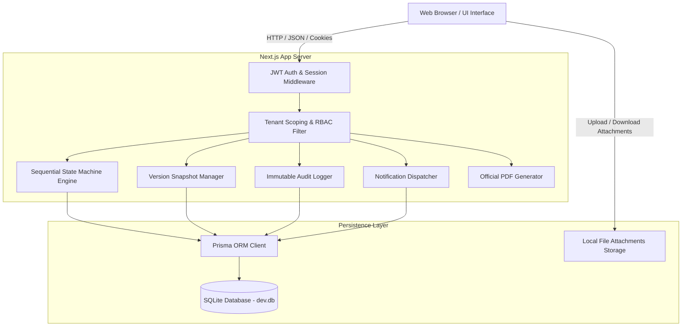
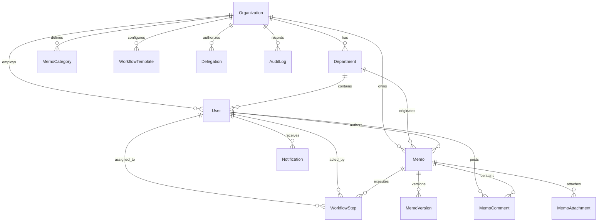
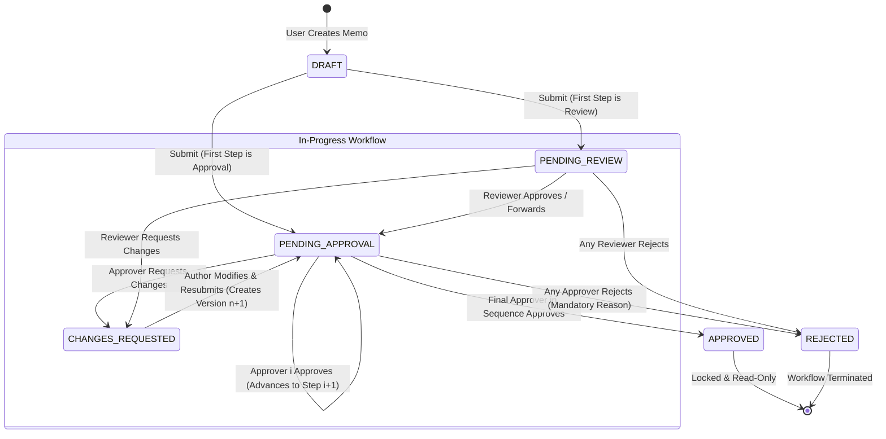

# Inter-Office Memo Management System
## Comprehensive System & Technical Documentation

- **Student Name**: Al Shabab
- **Student ID**: 2523255630
- **Course Code**: CSE226
- **Course Title**: Foundations of Vibe Coding
- **Department**: Electrical and Computer Engineering
- **Institution**: North South University
- **Semester**: Summer 2026

---

## 1. System Overview

The **Inter-Office Memo Management System** is an enterprise-grade, multi-tenant web application designed to digitize, streamline, and govern internal organizational communications, multi-stage approval hierarchies, and review workflows.

The system enforces **strict tenant isolation**, allowing multiple independent organizations (such as universities, corporations, or public agencies) to utilize the platform concurrently with absolute data, user, and workflow segregation. Users can create rich-text memos, attach files, assign ordered multi-person review sequences, track turn-based approval statuses in real-time, revise memos upon change requests (with full version snapshots), temporarily delegate signing authority, and export official memos with verified approval stamps to high-resolution PDFs.

---

## 2. Requirements Implemented Matrix

| PRD Section | Requirement Category | Implementation Status | Implementation Details |
| :--- | :--- | :---: | :--- |
| **§ 2.1** | Multi-Tenant Organization Management | **100% Complete** | Support for multiple tenants (`NSU`, `Apex`), departments, user isolation, and org profile management. |
| **§ 2.2** | User Authentication & Profiles | **100% Complete** | JWT session authentication, bcrypt hashing, profile view/update, and password change with current verification. |
| **§ 2.3** | User Roles & Server-Side RBAC | **100% Complete** | Role validation (`ADMIN`, `USER`) and step-level authorization checked on all backend handlers. |
| **§ 3.1 & 3.2** | Memo Creation & Drafts | **100% Complete** | Auto-generated reference numbers (`NSU-2026-XXXX`), rich body, priority, categories, draft saving, editing, and submission. |
| **§ 4.1 – 4.4** | Sequential Memo Workflow Engine | **100% Complete** | Strict sequential state machine ($A \rightarrow B \rightarrow C \rightarrow D$); actions: Approve, Reject, Request Changes, and Forward. |
| **§ 5** | Memo Status Management | **100% Complete** | Full support for `DRAFT`, `SUBMITTED`, `PENDING_REVIEW`, `PENDING_APPROVAL`, `CHANGES_REQUESTED`, `REJECTED`, and `APPROVED`. |
| **§ 6.1 – 6.3** | Inbox, Sent Memos & Completed Archive | **100% Complete** | Dedicated Views: Action Required Inbox (with pending age), Sent / My Memos (with live assignee), and Completed Archive. |
| **§ 7** | Memo Details & Interactive Timeline | **100% Complete** | Official letterhead view, visual step progress tracker, and chronological history of all transitions. |
| **§ 8** | Comments & Discussion | **100% Complete** | Classified comment thread: General discussion, Approval comments, Rejection reasons, and Revision notes. |
| **§ 9** | Attachments & File Security | **100% Complete** | Secure multi-file upload & download with MIME validation, size checks (15MB), and tenant-scoped authorization. |
| **§ 10** | In-App Notifications | **100% Complete** | Real-time notification center with unread counter, filter by type, 1-click navigate, and mark read. |
| **§ 11** | Advanced Search & Filtering | **100% Complete** | Multi-parameter search by ref #, subject, text, author, department, priority, category, and status. |
| **§ 12** | Executive & User Dashboard | **100% Complete** | Status metric cards, urgent memo alerts, pending action previews, recent feed, and admin statistics. |
| **§ 13** | Department Management | **100% Complete** | Admin CRUD for departments, code assignment, status toggling, and member counts preserving historical data. |
| **§ 14** | Memo Categories | **100% Complete** | Admin CRUD for categories (Procurement, Academic, Financial, HR, Administrative, General). |
| **§ 15** | Workflow Templates | **100% Complete** | Reusable multi-step pipeline templates with predefined roles and step types. |
| **§ 16** | Authority Delegation | **100% Complete** | Temporary approval delegation for date ranges with complete non-repudiation audit trails. |
| **§ 17** | Memo Versioning & Snapshots | **100% Complete** | Incremental versioning (v1, v2...) on resubmission after change requests with side-by-side history viewer. |
| **§ 18** | Immutable Audit Log | **100% Complete** | Searchable audit trail logging user logins, submissions, approvals, rejections, revisions, and uploads. |
| **§ 19** | Turnaround & Velocity Reports | **100% Complete** | Visual analytics: Turnaround time (hours), approval ratios, department volume, and bottleneck metrics. |
| **§ 20** | PDF Export | **100% Complete** | Client-side official PDF generator with letterhead, signatures, and approval stamps. |
| **§ 21** | Security & Data Isolation | **100% Complete** | Server-side tenant verification, parameterized database queries, and input sanitization. |
| **§ 28** | Demonstration Requirements | **100% Complete** | Integrated 1-click **Demo Persona Switcher** and pre-populated seed data covering all test scenarios. |

---

## 3. Technology Stack

- **Frontend & Backend Architecture**: [Next.js 14](https://nextjs.org/) (App Router, Server Components & API Route Handlers)
- **Programming Language**: [TypeScript](https://www.typescriptlang.org/) (Strict static typing across frontend & backend)
- **Styling & UI Components**: [Tailwind CSS](https://tailwindcss.com/) with [Lucide React](https://lucide.dev/) Icons
- **Database & Persistence**: SQLite via [Prisma ORM](https://www.prisma.io/) (Zero-dependency local portability + PostgreSQL ready)
- **Authentication**: JWT session tokens signed with `jose`, stored in secure HTTP-only cookies, with `bcryptjs` password hashing
- **PDF Engine**: Client-side canvas rendering via `html2canvas` & `jspdf` with dedicated print CSS media queries

---

## 4. System Architecture

---

## 5. Database Design & Multi-Tenancy Strategy

Multi-tenancy is enforced at the core data-access layer. Every entity (except `Organization` itself) maintains a mandatory foreign key relationship `organizationId` referencing `Organization(id)`.

All API route handlers automatically extract the authenticated user's `organizationId` from the verified JWT session and inject `where: { organizationId: session.organizationId }` into all Prisma queries. Cross-tenant access attempts are rejected with `403 Forbidden`.

---

## 6. Sequential Workflow State Machine Design

The core of the memo management system is an ordered, turn-based sequential state machine:

### Delegation Logic
When participant $A$ is assigned to Step $i$, but is unavailable:
1. If $A$ configured an active delegation rule to colleague $B$ for the current date, $B$ is authorized to take action.
2. The workflow records: `status: APPROVED`, `assignedUserId: A.id`, `actedByUserId: B.id`.
3. The discussion comment and audit trail explicitly log: *"Approved by delegate [B.name] on behalf of [A.name]"*.

---

## 7. Security & Authorization Matrix

1. **Authentication**: Secure HMAC SHA-256 JWT tokens with 7-day expiration and strict verification against active database records.
2. **Password Security**: Passwords hashed with `bcryptjs` using 10 salt rounds. Plaintext passwords are never logged or exposed.
3. **Tenant Boundary Enforcement**: Queries are strictly scoped to `session.organizationId`.
4. **Step-Level Action Enforcement**: Only the currently assigned user or their active delegate can execute workflow actions.
5. **Attachment Protection**: Static download routes verify that the requesting user belongs to the same tenant and has memo access rights.

---

## 8. Vibe-Coding & AI-Assisted Engineering Process

1. **Requirement Decomposition**: The comprehensive PRD was ingested and mapped into a structured architecture plan covering database schema, sequential state transitions, authorization middleware, UI components, and test scenarios.
2. **Deterministic State Modeling**: The workflow state machine was designed with rigorous state validation rules to prevent out-of-turn approvals, unhandled rejection terminations, or orphaned change requests.
3. **Automated Verification**: The system was tested with automated Prisma database pushes, multi-tenant seed generation, and full Next.js production compilation.

---

## 9. Demonstration Credentials

All accounts use the password: **`password123`**

### North South University (Tenant 1)
- **Admin**: `admin@nsu.edu`
- **Vice Chancellor**: `vc@nsu.edu`
- **Dean SEPS**: `dean.seps@nsu.edu`
- **Chair ECE**: `chair.ece@nsu.edu`
- **Finance Director**: `finance@nsu.edu`
- **Faculty ECE (Author)**: `alice.ece@nsu.edu`
- **Faculty CSE (Author)**: `bob.cse@nsu.edu`

### Apex Global Technologies (Tenant 2 Isolation Test)
- **Admin**: `admin@apex.io`
- **CEO**: `ceo@apex.io`
- **VP Engineering**: `vp.eng@apex.io`
- **Staff Dev**: `john.doe@apex.io`
